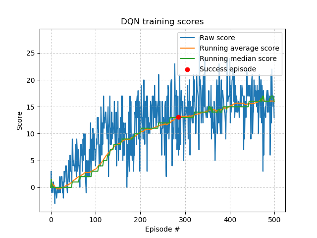
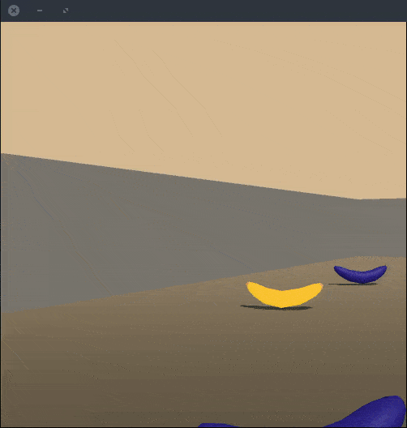

# Project report

This report details the experiments the repo owner has made to solve the navigation project of Udacity Deep Reinforcement Learning nanodegree.


## Learning algorithm

In order to have room for improvements, the agent was trained using a fixed Q-target with experience replay. Having the parameter update from Temporal Difference-learning,
$$
\Delta w = \alpha \Big(R + \gamma \max_a \hat{q}(S', a, w) - \hat{q}(S, A, w) \Big) \nabla_w \hat{q}(S, A, w)
$$
the TD target is supposed to be a replacement for the true value of  $q_\pi(S, A)$ . But it actually is dependent on $w$ and so the derivative of the objective function is incorrect.

To fix this, the TD target becomes
$$
R + \gamma \max_a \hat{q}(S', a, w^-)
$$
where $w^-$ is a copy of $w$ that won't change during the learning step. Additionally, experience replay is a buffer mechanism to provide a past experience sampler for the agent to learn.


**Model architecture**

The model architecture is a succession of 3 fully connected layers (the hidden layer having 64 input and output features), with ReLU activations. Optionally, batch normalization and dropout layers can be added after penultimate layers. This was added to prevent potential overfitting, which did not turn out to be a problem to reach the target score.


**Hyperparameters**

With default parameters, reaching the target score of `+13.0` would take ~450 episodes. 

```python
buffer_size = 1e5 # number of experiences that can be stored in buffer
batch_size = 64 # number of experiences that are sampled by the buffer
lr = 5e-4
gamma = 0.99
tau = 1e-3
update_freq = 4 # number of steps before next update
eps_start = 1.0 # random action initially
eps_decay = 0.99 # slow transition from exploration to greedy actions
eps_end = 0.01
```


In order to speed up to training, epsilon decay was decreased from `0.99` to `0.98` and final epsilon was doubled to `0.02`. The main idea was to maintain exploration higher than before in later stages, but to accelerate the transition from exploration to greedy actions.


## Results

Using the training setup described in the previous section, the training script is able to yield a consistent solving of the environment under 300 episodes. Below are the score statistics of the training run:



Now, the evaluation script uses the state dictionary of the trained agent to evaluate it in a non-training environment and the overall score remains consistently above `+13.0`, as shown in the evaluation run below:



Trained model parameters can be downloaded from this repository [release attachments](https://github.com/frgfm/banana-craving-monkey/tags).


## Further improvements

- Implement [Prioritized Experience replay](https://arxiv.org/abs/1511.05952) to improve the experience sampling by the buffer.
- Add a second type of model architecture: [Dueling DQN](https://arxiv.org/abs/1511.06581)

